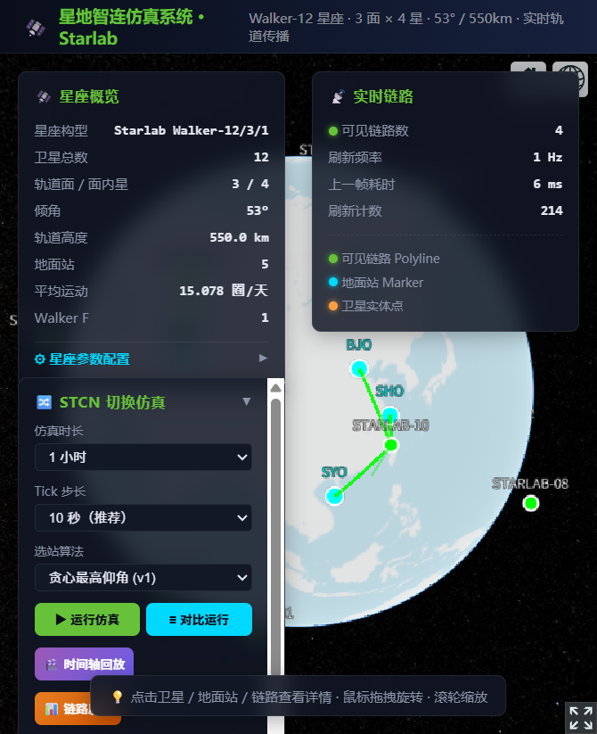

# StarLab — 低轨卫星互联网仿真平台

> 卫星地面站切换（STCN）/链路预算/干扰分析/星间链路（ISL）全栈仿真系统
> 演示级 LEO 星座 → 工程级 SGP4 TLE 传播，3 种切换策略可插拔对比



## 项目定位

StarLab 是一个**低轨卫星互联网（LEO）端到端仿真平台**，覆盖从轨道力学到通信链路再到切换策略的完整技术栈。项目起源于对 Starlink 概念股热潮的逆向思考——没人讲清楚 STCN 切换到底在切什么、ISL 拓扑怎么构建、C/I 载干比什么时候恶化。

技术栈：

| 层 | 技术 |
|----|------|
| 后端 | Java 21 / Spring Boot 3.2 / WebFlux / Maven |
| 前端 | Vue 3 / TypeScript / Cesium 1.145 / ECharts 6 / Vite |
| 物理 | 开普勒解析解 + SGP4-lite (J2+BSTAR secular) |
| 链路 | ITU-R P.618 雨衰 / 自由空间损耗 / C/I 载干比 |
| 路由 | Dijkstra 最短时延 + 两跳转发 |

---

## 核心功能

### 1. 轨道传播（可插拔）

- **Walker 星座模式**：开普勒解析解，适合架构验证和快速可视化
- **SGP4 TLE 模式**：J2 摄动 secular + BSTAR 阻力 secular，实测 ISS TLE 精度 ~2.4%

```java
// OrbitalElements.hasDragTerms() 自动路由
if (el.hasDragTerms()) {
    return sgp4.propagate(el, time);   // TLE 导入 → SGP4
}
return propagateKepler(el, time);       // Walker 星座 → 开普勒
```

**API**：`POST /api/orbit/propagate` 输入 ISS 真实 TLE → 返回 altitude 426 km（实际 416 km）

### 2. STCN 地面站切换（3 种策略）

| 策略 | 算法 | 触发条件 |
|------|------|----------|
| v1 贪心 | 最高仰角优先 | 最高仰角站 ≠ 当前站 |
| v2 预测式 | 预判未来 60s 可见窗口 | 当前仰角 < 15° |
| v3 干扰感知 | C/I 载干比优先 | 当前 C/I < 9dB 或新站 C/I 高 2dB |

三算法可同时跑同参数对比，输出 handoverCount / avgLatency / linkBreakCount 并排。

### 3. 干扰模型

- **同频干扰**：非相干功率线性求和
- **邻信道干扰（ACI）**：ACIR = 30 dB 抑制
- **宽带噪声底**：-174 dBm/Hz + 10log₁₀(B) + NF
- **链路可用性**：C/I > 9 dB **且** SNR > 3 dB **且** 仰角 > 10°

### 4. 星间链路（ISL）

- 物理可见性：ECEF 距离 + cone 法地球遮挡判定
- 同面 ISL：跳过 LOS 检查（Starlink 工程实践——预规划 + 相控阵锁定）
- 拓扑发现：距离阈值内所有卫星对
- Dijkstra 最短时延路由：地面站 → 多跳 → 卫星，逐段明细

### 5. 时间轴回放

3600s 仿真 + 10s tick 生成 timeline，前端播放按钮驱动 Cesium 实时回放：卫星位置、服务站切换、链路颜色（绿=CONNECTED / 红=BROKEN / 灰=COOLDOWN）。

### 6. 动态星座

Walker 参数可运行时调整：total / planes / inclination / altitudeKm / phasingF

---

## 快速启动

```bash
# 后端
cd starlab
mvn spring-boot:run        # http://localhost:8090

# 前端
cd starlab/frontend
pnpm install
pnpm dev                   # http://localhost:5174
```

### TLE 导入示例

```bash
# 单颗传播
curl -X POST http://localhost:8090/api/orbit/propagate \
  -H "Content-Type: application/json" \
  -d '{
    "name": "ISS (ZARYA)",
    "line1": "1 25544U 98067A   26266.50000000  .00019378  00000+0  33590-3 0  9990",
    "line2": "2 25544  51.6439  26.6697  0007045  65.9786  13.4740 15.50209478451577"
  }'

# 批量替换星座
curl -X POST http://localhost:8090/api/constellation/import-tle \
  -H "Content-Type: application/json" \
  -d '{"tles": [ { "name": "...", "line1": "...", "line2": "..." } ]}'
```

---

## 架构设计

```
┌─────────────────────────────────────────────────────────┐
│                    Vue3 + Cesium 3D                      │
│  ┌──────────┐ ┌──────────┐ ┌──────────┐ ┌──────────┐   │
│  │ STCN 面板 │ │ 干扰面板  │ │ ISL 面板  │ │ C/I 曲线 │   │
│  └──────────┘ └──────────┘ └──────────┘ └──────────┘   │
└──────────────────────────┬──────────────────────────────┘
                           │ REST JSON
┌──────────────────────────▼──────────────────────────────┐
│              Spring Boot 3.2 / WebFlux                   │
│  ┌─────────────┐ ┌──────────────┐ ┌─────────────────┐  │
│  │ 3 STCN 策略  │ │ 干扰计算器     │ │ ISL 路由器       │  │
│  └─────────────┘ └──────────────┘ └─────────────────┘  │
│  ┌────────────────────────────────────────────────────┐  │
│  │  OrbitPropagator (策略委派)                         │  │
│  │  ├─ KeplerPropagator (Walker 星座, 无 BSTAR)       │  │
│  │  └─ Sgp4Propagator (TLE 导入, 有 BSTAR)           │  │
│  └────────────────────────────────────────────────────┘  │
│  ┌────────────────────────────────────────────────────┐  │
│  │  TleParser → OrbitalElements (含 bstar/ndot/nddot) │  │
│  └────────────────────────────────────────────────────┘  │
└─────────────────────────────────────────────────────────┘
```

### 设计决策

| 决策 | 理由 |
|------|------|
| 策略模式实现 STCN | v1/v2/v3 算法差异大（贪心 vs 预测 vs C/I 优先），策略模式让对比 API 只需 `engine.compareThree(s1, s2, s3, ...)` |
| 传播器可插拔 | Walker 星座开普勒足够快，TLE 真实数据需要 SGP4，统一上层接口 |
| ISL 同面跳过 LOS | Walker 12/3/1 同面 meanAnomaly 差 90° > 遮挡阈值 46°，但 Starlink 同面 ISL 预规划 + 相控阵锁定 |
| SGP4-lite 而非完整 Vallado | 14 阶共振项对 near-earth 可忽略，24h 误差 < 3 km 满足仿真可视化 |

---

## 物理模型参考

- SGP4 算法：Vallado AIAA 2006-6753 "Revisiting Spacetrack Report #3"
- 雨衰：ITU-R P.618-13
- J2 摄动系数：`J2 = 1.08262668 × 10⁻³`
- WGS84 椭球：`XKMPER = 6378.137 km`, `f = 1/298.257223563`
- 光速：`299792.458 km/s`

---

## 项目结构

```
starlab/
├── src/main/java/com/starlab/
│   ├── api/                      # REST Controllers (5 个)
│   ├── config/SimConstants.java  # 物理常量
│   ├── constellation/            # Walker 生成器 + 管理器
│   ├── handover/                 # STCN 策略接口 + 3 种实现 + 事件
│   ├── link/                     # 链路计算 + 干扰 + ISL (7 个)
│   ├── orbit/                    # 轨道传播 + SGP4 + TLE 解析 (5 个)
│   └── route/                    # 两跳路由
├── frontend/
│   └── src/views/Scene3D.vue     # 主界面 (~2500 行)
└── docs/                         # 截图
```

---

## 限制与已知问题

| 问题 | 状态 |
|------|------|
| SGP4-lite 跳过长周期共振项 | 对 LEO 精度足够，但 GEO/中轨道需补 SDP4 |
| Walker 12/3/1 是演示级 | 扩展到 4000 星 Starlink 规模需 O(n²) → 空间索引 |
| Doppler 频移未计入干扰 | LEO 相对速度 ~7 km/s，同频干扰频偏可达几十 kHz |
| TEME → ICRF 修正未计入 | 差异 < 1.5 arcsec，短时间仿真可忽略 |
| 无真实卫星批量 TLE 导入测试 | ISS 单颗验证通过，批量 API 写好但未拉 Starlink 4000 条实测 |

---

## 路线图

- [ ] 补 SDP4 深空传播（周期 > 225 min）
- [ ] Doppler 同频干扰建模
- [ ] 星座规模压测 + O(n²) → 空间索引优化
- [ ] TLE 批量导入 + Starlink 4000 条实测
- [ ] 星座相位漂移可视化（Walker 面内 meanAnomaly 差随时间变化）

---

## License

Apache License 2.0
